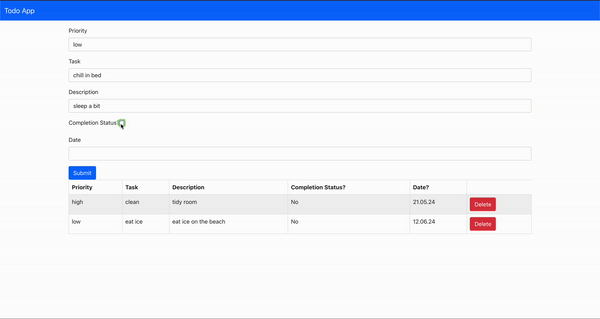

# Demo


# Usage / Quick-Start

```bash
# clone repo
git clone https://github.com/matsjfunke/react-fastapi-todo.git
# start docker containers
docker-compose -f docker-compose.yml up
```
- than access it under localhost:3000


# Comunication between react & fastapi

- this api.js file tells frontend where backend is located
    ```javascript
    /*
    api.js creates an Axios instance named api with a base URL of http://localhost:8000,
    which can be imported / used throughout the frontend app 
    to send HTTP requests to the specified server.
    */
    import axios from 'axios'

    const api = axios.create({
        baseURL: 'http://localhost:8000',
    })

    export default api;
    ```

- Cross-Origin Resource Sharing allows React frontend to access backend endpoints
    ```python
    origins = [
        # react app runs there
        "http://localhost:3000"
    ]

    app.add_middleware(
        CORSMiddleware,
        allow_origins=origins,
        allow_credentials=True,
        allow_methods=["*"],
        allow_headers=["*"]
    )
    ```
